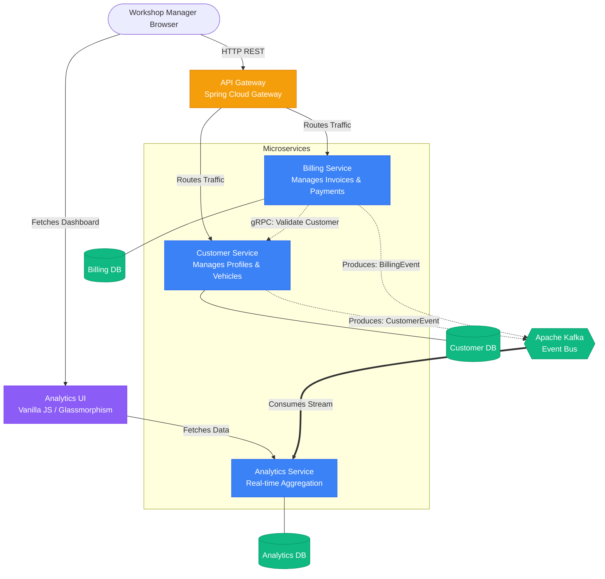
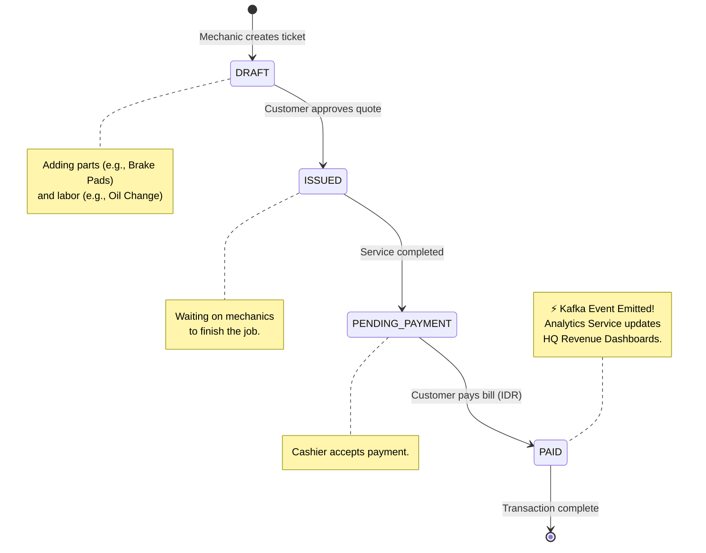

# Welcome to AutoFixera 👋

AutoFixera is a next-generation, cloud-native auto repair franchise management system. 

We simulate a large-scale, nationwide chain of automotive workshops operating across Indonesia. Our platform handles thousands of concurrent transactions—from tracking customer vehicles and parts inventory to issuing complex invoices and streaming real-time revenue analytics back to the central headquarters.

---

## 🏢 Business Overview

In the fast-paced auto repair industry, tracking parts, labor, and customer histories across hundreds of franchised garages is a logistical nightmare. AutoFixera solves this by decentralizing operations into highly scalable microservices while centralizing the data flow for real-time visibility.

- **Scale:** Simulates high-throughput workshop transactions.
- **Currency:** Fully localized to Indonesian Rupiah (IDR).
- **Domain:** Automotive repair, servicing, parts replacement, and customer loyalty.

---

## 🏗️ Ecosystem Architecture

AutoFixera is built on a modern event-driven microservices architecture utilizing **Java, Spring Boot 3, Apache Kafka, and PostgreSQL**.

---

## 💸 Core Domain Workflow: The Invoice Lifecycle

The core of the AutoFixera business is the workshop service invoice. 

When a customer brings their car in for an oil change or major repair, an invoice is generated. This invoice travels through several states, triggering asynchronous Kafka events that update our company-wide analytics dashboard in real-time.

---

## 📂 Repository Index

Our ecosystem is split into domain-specific repositories to ensure strict isolation and independent deployment cycles.

| Repository | Description | Primary Tech Stack |
| --- | --- | --- |
| **`autofixera-infra`** | The heart of our local and cloud orchestration. Contains Docker Compose files and Makefiles to spin up the entire ecosystem. | Docker, GNU Make, Bash |
| **`api-gateway`** | The unified entry point. Handles all routing and cross-cutting concerns for incoming HTTP requests. | Spring Cloud Gateway |
| **`customer-service`** | Manages customer profiles, vehicle data, and exposes gRPC endpoints for synchronous validation. | Spring Boot 3, PostgreSQL, gRPC |
| **`billing-service`** | Handles invoice generation, payment processing, and pushes financial events to Kafka. | Spring Boot 3, PostgreSQL, Kafka |
| **`analytics-service`** | A high-performance consumer that materializes Kafka event streams into queryable metrics for HQ. | Spring Boot 3, PostgreSQL, Kafka |
| **`analytics-ui`** | A blazing-fast, 100/100 Lighthouse score frontend dashboard with a premium dark-mode glassmorphism design. | Vanilla JS/CSS, HTML5, Nginx |
