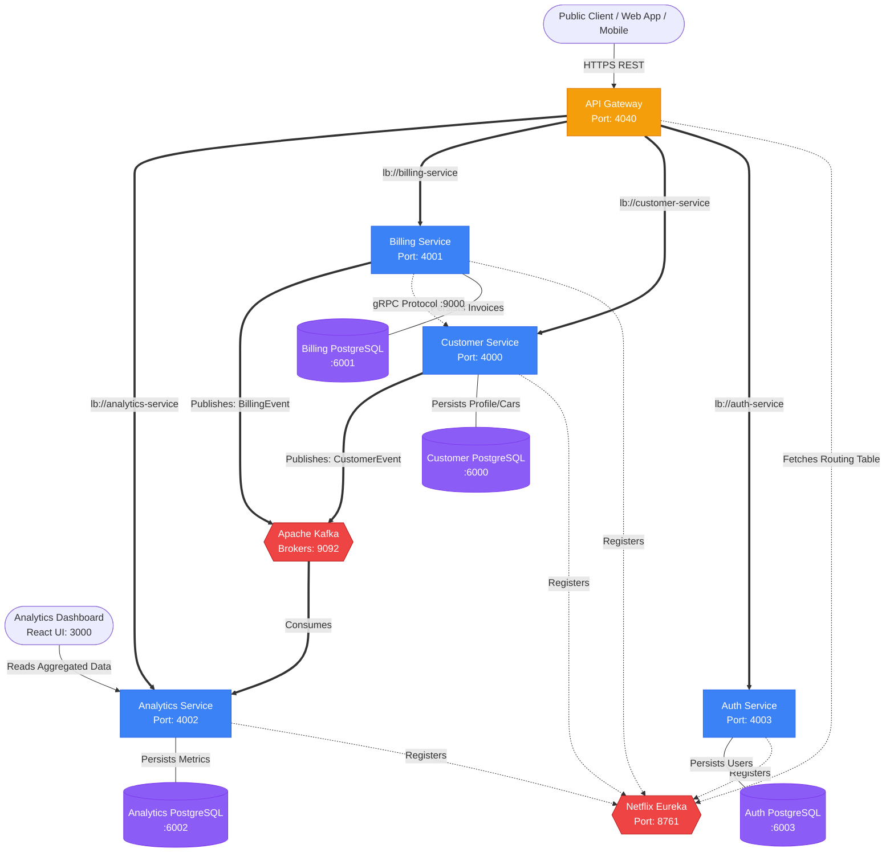

# Autofixera Engineering Profile


Welcome to the **Autofixera Engineering Organization**. This document serves as the absolute source of truth for our entire application ecosystem, detailing the exact architecture, data flows, communication protocols, Site Reliability Engineering (SRE) practices, and developer onboarding guides.

---

## 1. Executive Summary & Vision

**Autofixera** is an enterprise-grade, cloud-native microservices ecosystem designed to modernize automotive repair shops and workshop management. Our platform digitizes the entire lifecycle of a vehicle repair: from customer registration and vehicle intake, through the mechanical servicing, all the way to final invoice generation, payment processing, and business analytics.

Built entirely on **Java 21** and **Spring Boot 3.5.x**, the architecture leverages cutting-edge distributed systems patterns including **Event-Driven Architecture (EDA)** via Apache Kafka, ultra-low latency internal RPCs via **gRPC**, and dynamic client-side load balancing via **Netflix Eureka**.

---

## 2. Global System Architecture

The Autofixera platform is composed of several isolated, specialized microservices that communicate both synchronously (REST/gRPC) and asynchronously (Kafka).



---

## 3. Detailed Data Flow & Service Interactions

To truly understand Autofixera, one must understand how data traverses the network. Below are the distinct data flows mapping out the lifecycle of our core domain objects.

### 3.1 Authentication & Security Flow
Security is handled at the edge, but authorization logic is centralized in the `Auth Service`.

1. **User Login Request**: A client sends a POST request with `email` and `password` to `POST /api/auth/login`.
2. **API Gateway Interception**: The API Gateway (running on port 4040) receives the request. It queries the Eureka registry to resolve the IP of a healthy `Auth Service` instance.
3. **Database Verification**: The `Auth Service` queries the Auth PostgreSQL database. It validates the password hash using **BCrypt (Strength 12)**.
4. **Token Generation**: If successful, a stateless JSON Web Token (JWT) is generated and signed using `HS256` cryptography.
5. **Downstream Authentication**: For all subsequent requests to protected endpoints (e.g., creating a customer), the client includes the JWT in the `Authorization: Bearer <token>` header.
6. **Validation**: Protected services can hit `GET /api/auth/validate` to verify token integrity before processing state-altering requests.

**JWT Payload Example**:
```json
{
  "sub": "admin@autofixera.com",
  "roles": ["ROLE_ADMIN"],
  "iat": 1718302910,
  "exp": 1718389310
}
```

### 3.2 The Customer Onboarding Flow
When a new customer arrives at a workshop to service their vehicle:

1. **Registration via REST**: The client hits `POST /api/customers/register`.
2. **Gateway Routing**: Routed via `lb://customer-service` to the Customer Service.
3. **Persistence**: The Customer Service persists the `CustomerEntity` and `CarEntity` into the Customer PostgreSQL database.
4. **Event Sourcing (Kafka)**: 
   - Synchronously, the HTTP thread finishes and returns `201 Created`.
   - Asynchronously, a `CustomerEvent` is serialized into JSON and pushed to the Apache Kafka topic `customer-events`.
5. **Analytics Consumption**: The `Analytics Service` consumes the `CustomerEvent`. It increments the daily active user counters in the Analytics PostgreSQL database.

**Kafka Event Payload Example (`customer-events`)**:
```json
{
  "eventId": "evt_09182312",
  "eventType": "CUSTOMER_CREATED",
  "timestamp": "2026-06-24T12:00:00Z",
  "data": {
    "customerId": "cust_88219",
    "email": "user@example.com",
    "tier": "STANDARD"
  }
}
```

### 3.3 The Billing & Invoicing Flow (gRPC Integration)
Once the vehicle is repaired, a mechanic issues an invoice. This flow highlights our synchronous internal RPCs.

1. **Draft Invoice Creation**: The client sends a `POST /api/invoices/create` request containing a `customerId` and an array of `serviceItems`.
2. **Gateway Routing**: Routed to the `Billing Service`.
3. **gRPC Data Hydration**:
   - The Billing Service needs the customer's full profile (name, email, membership status) to calculate discounts and embed data into the invoice PDF.
   - It **does not** use REST to ask the Customer Service.
   - Instead, it opens a Protobuf-encoded **gRPC Channel** on port `9000` directly to the `Customer Service`.
   - The Customer Service responds in microseconds.
4. **Persistence & Payment**: The invoice is saved as `PENDING`. When the client pays via `POST /api/payments/pay`, the state changes to `PAID`.
5. **Financial Event Sourcing**: A `BillingEvent` containing the transaction total is published to the `billing-events` Kafka topic.
6. **Analytics Aggregation**: The Analytics Service consumes this event, aggregates the total daily revenue, and updates the Realtime Dashboard.

---

## 4. Comprehensive Microservice Breakdown

The ecosystem utilizes the Strangler Fig pattern for domain isolation.

### 4.1 API Gateway (`api-gateway`)
- **Framework**: Spring Cloud Gateway, WebFlux (Project Reactor).
- **Responsibility**: Single Entry Point, edge routing, global CORS, and OpenAPI documentation aggregation.
- **Routing Strategy**: Uses `lb://` protocol to dynamically discover service IPs. This completely mitigates DNS caching issues inherent in Docker networks.
- **Swagger UI**: Exposes an aggregated Swagger UI at `http://localhost:4040/docs`.

### 4.2 Eureka Server (`eureka-server`)
- **Framework**: Spring Cloud Netflix Eureka.
- **Responsibility**: The Phonebook of the cluster.
- **SRE Configuration**: In the `dev` profile, we disable self-preservation (`eureka.server.enable-self-preservation=false`) and set eviction intervals to 5 seconds. This guarantees that restarting a container locally will not cause 500 errors on the Gateway due to stale IPs.

### 4.3 Auth Service (`auth-service`)
- **Framework**: Spring Security, JJWT.
- **Database**: PostgreSQL (Port 6003).
- **Features**: Stateless token issuance. Flyway is used to automatically migrate the schema and seed the initial `admin@autofixera.com` account.

### 4.4 Customer Service (`customer-service`)
- **Protocols**: HTTP REST (4000) & gRPC Provider (9000).
- **Database**: PostgreSQL (Port 6000).
- **Responsibilities**: Maintains the Source of Truth for customer profiles. Exposes a gRPC service defined by `CustomerServiceGrpc`.

### 4.5 Billing Service (`billing-service`)
- **Protocols**: HTTP REST (4001) & gRPC Client.
- **Database**: PostgreSQL (Port 6001).
- **Responsibilities**: Generates invoices, processes simulated payments, and handles state transitions (`DRAFT` -> `PENDING` -> `PAID`).

### 4.6 Analytics Service (`analytics-service`)
- **Protocols**: HTTP REST (4002) & Kafka Consumer.
- **Database**: PostgreSQL (Port 6002).
- **SRE Configuration**: Employs strictly **Manual Acknowledgment** (`enable-auto-commit: false`, `ack-mode: MANUAL_IMMEDIATE`). This guarantees *At-Least-Once* delivery. If the database goes down while processing a Kafka event, the offset is not committed, preventing data loss.

---

## 5. Technology Stack Deep Dive

### 5.1 Java 21 & Spring Boot 3.5
We utilize Java 21's Virtual Threads (Project Loom) where applicable to reduce memory overhead and increase concurrent request capacity. Spring Boot 3.5 provides native compilation readiness and deeper observability metrics.

### 5.2 gRPC & Protocol Buffers (Protobuf)
Why gRPC?
- **Binary Payload**: Protobuf drastically reduces payload size compared to JSON.
- **HTTP/2**: Multiplexed connections allow thousands of internal RPC calls without socket exhaustion.
- **Strong Typing**: The `.proto` files act as a strict contract between `billing-service` and `customer-service`.

```protobuf
// Example Customer Service Contract
syntax = "proto3";
package com.autofixera.grpc.customer;

option java_multiple_files = true;
option java_package = "com.autofixera.grpc.customer";

service CustomerService {
    rpc GetCustomer (CustomerRequest) returns (CustomerResponse);
}

message CustomerRequest {
    string customer_id = 1;
}

message CustomerResponse {
    string name = 1;
    string email = 2;
    string membership_tier = 3;
    repeated CarInfo vehicles = 4;
}

message CarInfo {
    string license_plate = 1;
    string make = 2;
    string model = 3;
}
```

### 5.3 Apache Kafka (Event-Driven Architecture)
We use Kafka to decouple domain boundaries. The `Billing Service` shouldn't care if the `Analytics Service` is offline. By publishing to Kafka, events are stored persistently until consumers are ready to read them.

We provision our Kafka cluster using Kraft mode (Zookeeper-less) in production, reducing infrastructure complexity.

### 5.4 Database Topology
Each microservice is entirely self-sufficient. There are no shared databases. This prevents cascading failures and ensures loose coupling.

---

## 6. Observability & SRE Best Practices

To qualify as an enterprise system, code must fail gracefully.

1. **Graceful Shutdowns**: All Spring Boot services contain `server.shutdown=graceful` and `spring.lifecycle.timeout-per-shutdown-phase=20s`. When a container is killed, Spring stops accepting new HTTP traffic but waits up to 20 seconds for inflight transactions to finish before terminating the JVM.
2. **Healthchecks**: Actuator `/actuator/health` is exposed. Eureka uses this endpoint to determine if an instance should be routed to.
3. **Database Migrations**: Flyway guarantees that schema changes are version-controlled and applied sequentially on startup.
4. **Retry Mechanisms**: Internal REST clients and Kafka consumers implement exponential backoff retry logic.

---

## 7. Infrastructure & Local Development Guide

The infrastructure is deeply modularized to prevent monolithic Docker Compose files. The workspace structure is as follows:

```text
workspace/
├── auth-service/
├── customer-service/
├── billing-service/
├── analytics-service/
├── api-gateway/
├── eureka-server/
└── autofixera-infra/
    ├── app-compose/         # The backend JVM containers
    ├── gateway-compose/     # The Gateway
    ├── infra-compose/       # Postgres & Kafka
    └── Makefile
```

### 7.1 Docker Compose Architecture
We isolate concerns into separate compose layers:
- `infra-compose`: Boots stateful services like PostgreSQL and Kafka that rarely change and hold persistent volumes.
- `app-compose`: Boots the rapidly changing business logic applications.
- `gateway-compose`: Handles the entry layer.

Example `infra-compose.yml` structure:
```yaml
version: '3.8'
services:
  afx-kafka:
    image: bitnami/kafka:latest
    environment:
      - KAFKA_ENABLE_KRAFT=yes
      - KAFKA_CFG_PROCESS_ROLES=broker,controller
      ...
  af-auth-service-db:
    image: postgres:15-alpine
    volumes:
      - ../mounts/auth_db:/var/lib/postgresql/data
```

### 7.2 Running the Ecosystem
To orchestrate the environment effortlessly, navigate to the `autofixera-infra` directory and utilize the `Makefile`.

```bash
# 1. Compile all Java projects
# Run this inside each microservice directory or via global bash script
./mvnw clean compile

# 2. Boot the infrastructure
cd autofixera-infra
make dev
```

The `make dev` command spins up:
1. Zookeeper & Kafka Broker
2. 4 isolated PostgreSQL databases
3. Eureka Server
4. Auth, Customer, Billing, and Analytics services
5. API Gateway

### 7.3 Port Mapping Reference

| Component | Dev Machine Port | Internal Network Port | Protocol |
| :--- | :--- | :--- | :--- |
| **API Gateway** | `4040` | `4040` | HTTP |
| **Eureka Server** | `8761` | `8761` | HTTP |
| **Auth Service** | `4003` | `4003` | HTTP |
| **Customer Service** | `4000` | `4000` | HTTP |
| **Billing Service** | `4001` | `4001` | HTTP |
| **Analytics Service** | `4002` | `4002` | HTTP |
| **Auth Postgres** | `6003` | `5432` | TCP |
| **Customer Postgres** | `6000` | `5432` | TCP |
| **Billing Postgres**| `6001` | `5432` | TCP |
| **Analytics Postgres**| `6002` | `5432` | TCP |
| **Kafka Broker** | `9092` | `9092` | TCP |
| **Customer gRPC** | `-` | `9000` | HTTP/2 |
| **Billing gRPC** | `-` | `9001` | HTTP/2 |

---

## 8. API Definitions & Standards

We strictly adhere to the OpenAPI 3.0 specification. 
Instead of navigating to individual services to read API documentation, the **API Gateway** aggregates them using Springdoc OpenAPI Webflux.

To view the interactive Swagger UI, start the cluster and visit:
👉 `http://localhost:4040/docs`

From the dropdown menu in the top right, you can seamlessly switch between inspecting the Auth API, Customer API, Billing API, and Analytics API.

All REST endpoints follow standard RESTful conventions:
- `GET` for resource retrieval.
- `POST` for resource creation.
- `PUT`/`PATCH` for resource updates.
- `DELETE` for resource deletion.

Response formats are standardized:
```json
{
  "timestamp": "2026-06-24T12:00:00Z",
  "status": 200,
  "message": "Success",
  "data": { ... }
}
```

Errors are mapped to RFC-7807 Problem Details:
```json
{
  "type": "https://autofixera.com/errors/not-found",
  "title": "Customer Not Found",
  "status": 404,
  "detail": "Customer with ID cust_88219 does not exist in the system.",
  "instance": "/api/customers/cust_88219"
}
```

---

## 9. Contribution Guidelines & Onboarding

### 9.1 Developer Workstation Setup
1. Install JDK 21 (Temurin or Amazon Corretto recommended).
2. Install Docker Desktop.
3. Install an IDE like IntelliJ IDEA or Eclipse.
4. Clone all repositories into a single unified workspace folder.

### 9.2 Development Workflow
1. **Feature Branching**: Always branch off `main` using the format `feature/<JIRA-ID>-description`.
2. **No Lombok**: As per architectural guidelines, we strictly avoid Lombok. All constructors, getters, setters, and builders must be explicitly written out to ensure IDE compatibility and code clarity.
3. **Commit Messages**: Follow conventional commits (`feat:`, `fix:`, `chore:`, `refactor:`).

### 9.3 Protobuf & gRPC Workflow
If you modify a `.proto` file in `src/main/proto`:
1. You MUST run `./mvnw clean compile` to generate the new Java stubs.
2. Ensure both the server (Provider) and client (Consumer) update their proto files in tandem. Protobuf guarantees backwards compatibility if fields are appended, not removed.

### 9.4 Running Tests
All services are required to maintain a minimum of 80% test coverage using JUnit 5 and Mockito.
Integration tests utilize **Testcontainers** to spin up ephemeral PostgreSQL and Kafka instances.

Run the test suite via:
```bash
./mvnw clean test
```

---

## 10. Security Posture

Our security model follows a Defense-in-Depth approach:
- **Network Boundaries**: Databases are NOT exposed to the public internet. They only listen on the internal Docker network.
- **JWT Lifespans**: Tokens are short-lived (15-60 minutes).
- **Transport Security**: In production, the API Gateway terminates SSL/TLS.
- **Secrets Management**: No passwords or keys are hardcoded in `application.yml`. All variables (like `DB_PASSWORD`, `JWT_SECRET`) are injected dynamically from secure vaults or environment variables.

---

## 11. License

Autofixera Core components are proprietary. Open-source toolings and SDKs released under this organization are licensed under the MIT License.

---
*Maintained with ❤️ by the Autofixera Core Infrastructure Team.*
*Document Revision: V2.1.1*
*Architecture Scale: Enterprise/Cloud-Native*
