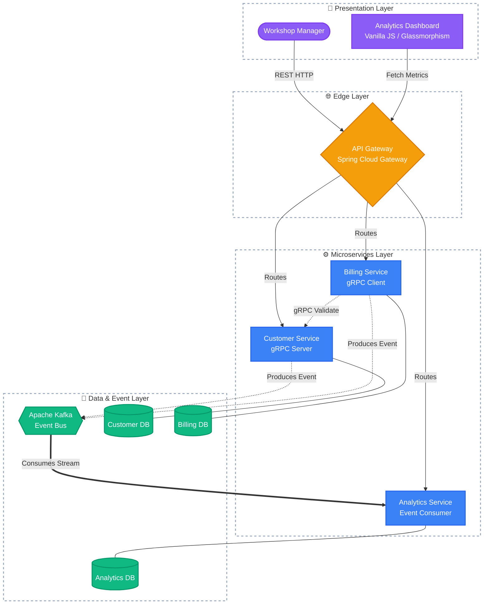
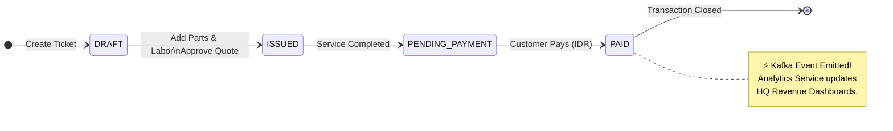

# Welcome to AutoFixera

> **AutoFixera** is a next-generation, cloud-native auto repair franchise management system.

We simulate a large-scale, nationwide chain of automotive workshops operating across Indonesia. Our platform handles thousands of concurrent transactions—from tracking customer vehicles and parts inventory to issuing complex invoices and streaming real-time revenue analytics back to the central headquarters.

---

## Business Overview

In the fast-paced auto repair industry, tracking parts, labor, and customer histories across hundreds of franchised garages is a logistical nightmare. AutoFixera solves this by decentralizing operations into highly scalable microservices while centralizing the data flow for real-time visibility.

* **Scale:** Built to simulate high-throughput, concurrent workshop transactions.
* **Currency:** Fully localized to Indonesian Rupiah (IDR).
* **Domain Focus:** Automotive repair workflows, servicing schedules, parts replacement, and customer loyalty retention.

---

## Ecosystem Architecture

AutoFixera is built on a modern, event-driven microservices architecture utilizing **Java, Spring Boot 3, Apache Kafka, and PostgreSQL**. 

The system is organized into distinct layers to ensure separation of concerns, scalability, and resilience.

---

## Core Domain Workflow: The Invoice Lifecycle

The core of the AutoFixera business is the workshop service invoice.

When a customer brings their car in for an oil change or major repair, an invoice is generated. This invoice travels through several strictly validated states, ultimately triggering asynchronous Kafka events that update our company-wide analytics dashboard in real-time.

---

## Repository Index

Our ecosystem is intentionally split into domain-specific repositories. This mono-repo structure ensures strict isolation, independent deployment cycles, and clear domain boundaries.

| Repository | Primary Tech Stack | Description |
| --- | --- | --- |
| **`autofixera-infra`** | Docker, GNU Make, Bash | The heart of our local and cloud orchestration. Contains Docker Compose files and Makefiles to spin up the entire ecosystem seamlessly. |
| **`api-gateway`** | Spring Cloud Gateway | The unified entry point. Handles all routing, CORS, and cross-cutting concerns for incoming HTTP requests. |
| **`customer-service`** | Spring Boot 3, PostgreSQL, gRPC | Manages customer profiles, vehicle data, and exposes high-performance gRPC endpoints for synchronous data validation. |
| **`billing-service`** | Spring Boot 3, PostgreSQL, Kafka | Handles invoice generation, payment processing, and reliably pushes financial events to the message broker. |
| **`analytics-service`** | Spring Boot 3, PostgreSQL, Kafka | A high-performance consumer that materializes Kafka event streams into highly queryable metrics for HQ. |
| **`analytics-ui`** | Vanilla JS/CSS, HTML5, Nginx | A blazing-fast, frontend dashboard featuring a premium dark-mode glassmorphism design. |

